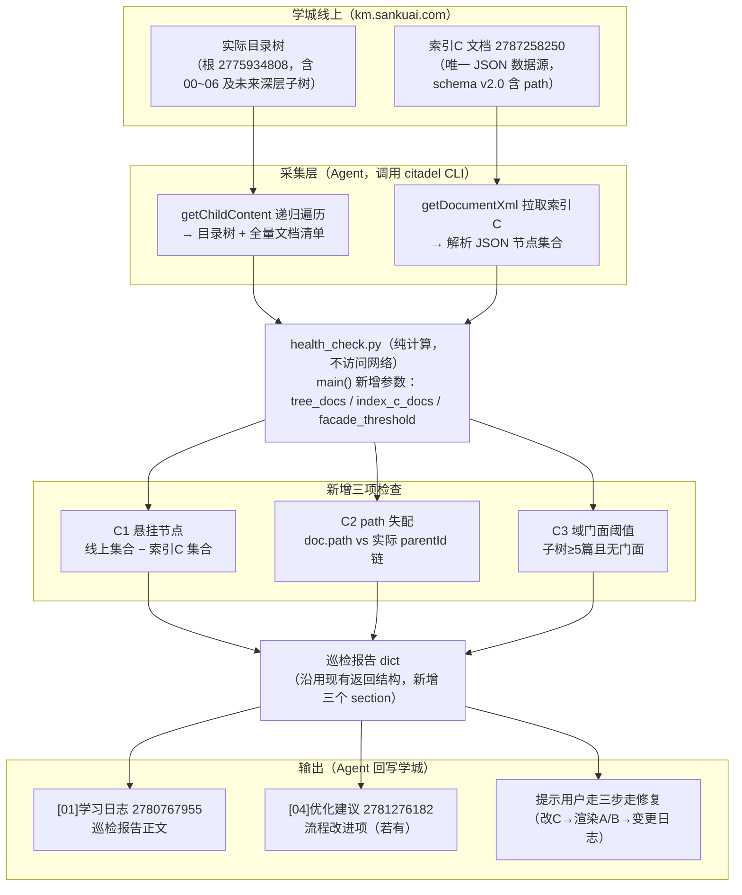

# 灵猫知识库优化文档（R5 巡检增强 + 检索权重讨论）

> 版本：v2 ｜ 原始日期：2026-09-17 ｜ 重构日期：2026-09-18
> 交付对象：lingcat-knowledge-gardener skill 的 health_check.py 模块研发（第一部分）
> 关联文档：索引C（https://km.sankuai.com/collabpage/2787258250）、[01]学习日志（https://km.sankuai.com/collabpage/2780767955）、[04]优化建议（https://km.sankuai.com/collabpage/2781276182）
>
> 文档结构说明：
> - **第一部分（一~七章）**：R5 结构一致性巡检研发需求，本期交付内容，已定稿；
> - **第二部分（八~十三章）**：检索权重与 RAG 优先级讨论，含 2026-09-18 评审结论，**暂缓落地**，仅红线约定为当前执行项。

---

# 第一部分：R5 结构一致性巡检（研发需求，本期交付）

> 来源：《灵猫三级索引-gardener需求.md》R5 项

## 一、背景

### 1.1 知识库索引架构（现状）

灵猫通识知识库（学城，根 contentId 2775934808）的检索体系为"单一数据源 + 双视图"架构：

- **索引C**（学城文档 2787258250）：唯一权威索引数据源，正文为一个 JSON 代码块，含全库每个文档的 contentId、path（完整目录路径，schema v2.0 新增）、weight、status、summary、keywords、query_hint 等元数据；
- **索引A / 索引B**：由索引C 渲染生成的人读导航视图 / Agent 关键词反查视图，禁止手改；
- **变更日志**（2786789270）：记录库结构版本历史。

### 1.2 维护纪律与风险

结构变更依赖人工纪律执行"三步走"：①修改索引C → ②重新渲染A/B → ③变更日志追加一行。三步必须同批次完成。

问题在于：**这套纪律没有任何自动校验兜底**。只要有人绕过流程（在学城页面上直接新建子目录、移动/改名文档，而不改索引C），索引C 与实际目录树就会发生漂移且**无任何告警**——Agent 按索引C 检索时会漏掉新文档或指向已移动的文档。随着知识库目录树加深（schema v2.0 已支持任意深度 path）、参与维护的人增多，漂移概率单调上升。

### 1.3 目标

给现有巡检脚本 `health_check.py` 增加三项**结构一致性检查**，把"发现漂移"从依赖人工眼力变为周期性自动巡检，形成防漂移兜底网。

## 二、现有实现（研发需了解的约定）

`health_check.py` 位于 gardener skill 的 `scripts/` 目录，**不走** `lib/writer.py`，设计约定是"脚本纯计算、不访问网络"：所有线上数据由调用方（Agent）事先通过 citadel CLI 采集并结构化后传入 `main()`。现有签名：

```python
main(
    version_log_rows: list[dict],       # 00/变更日志索引表数据
    existing_content_ids: set,          # 索引C 中已登记的 contentId 集合
    pending_rows: list[dict],           # [05]待人工审核索引表数据
    coverage_rows: list[dict],          # 01~05 业务目录覆盖情况
    experience_scenes: list[str],       # [02]经验沉淀场景列表
) -> dict                              # 返回巡检报告，由 Agent 写入 [01]学习日志
```

巡检频率：建议每周一次（人工或自动化触发均可）。

## 三、需求详述：新增三项检查

| # | 检查项 | 一句话逻辑 | 严重级别 |
|---|--------|-----------|---------|
| C1 | 悬挂节点 | 线上目录树实际存在、但索引C 未登记的文档 | 高 |
| C2 | path 失配 | 索引C 中 doc.path 与该文档实际 parentId 链不一致（被移动/改名） | 高 |
| C3 | 域门面阈值 | 某子树文档 ≥5 篇且尚未建域门面导读页 | 低（建议级） |

### C1 悬挂节点（已存在未入索引）

**输入**：线上目录树全量遍历结果（含每篇文档 contentId、title、所在目录链）；索引C 节点集合。
**算法**：集合差——`线上文档集合 - 索引C登记集合`，再排除已知白名单（治理文档本身：索引A/B/C、变更日志、00 正文、根文档；以及 status=placeholder 的占位文档按现有规则可选排除）。
**输出**：悬挂节点清单（contentId、title、实际路径），并给出修复建议文案："走三步走补登记"。

### C2 path 失配（文档位置漂移）

**输入**：索引C 中每个 doc 的 path 字段；同一文档由线上遍历得到的实际路径。
**算法**：逐条比对 `index_c_doc.path` 与 `actual_path`（均规范化为 `一级目录/子目录/…` 格式，不含文档名）。不一致即失配。
**输出**：失配清单（contentId、索引C 记录路径、实际路径），建议文案："更新索引C path 并重渲染A/B"。

### C3 域门面阈值提醒

**输入**：线上目录树（含父子关系）；已建域门面的子树集合（索引C 中 path 指向域根且为门面导读页的叶子）。
**算法**：按实际目录树聚合每个子树的文档数，`count ≥ 5 且无门面` 时命中。阈值建议作为参数（默认 5，可配 3~8）。
**输出**：建议建域门面的子树清单（子树路径、文档数），建议文案："经人工确认后按 00 维护规则第七条建域内导读页"。此项仅是建议，不构成错误。

## 四、数据流与整体链路



巡检发现问题的修复闭环：C1/C2 命中 → 提示走三步走补登记/改 path → 变更日志留痕；C3 命中 → 人工确认后建域门面。**脚本只报告、不自动修复**。

## 五、接口变更建议

`main()` 在现有五个参数基础上新增三个（保持向后兼容，缺省时跳过对应检查）：

```python
main(
    ...,                                   # 现有参数不变
    tree_docs: list[dict] = None,          # [{"contentId":..., "title":..., "path": "01-xxx/子目录"}] 线上实际结构
    index_c_docs: list[dict] = None,       # [{"contentId":..., "path":...}] 索引C 登记数据
    facade_threshold: int = 5,             # C3 阈值
) -> dict
```

返回报告建议新增 `structure_check` section，含 `hanging_nodes` / `path_mismatch` / `facade_candidates` 三个列表及各自的建议文案。

## 六、验收标准

1. 用当前线上真实数据（25 节点、18 篇入索引文档、schema v2.0）跑一次：C1 应为空（或仅白名单差异）、C2 应为空、C3 应为空——即"健康库零误报"。
2. 人为构造样例：本地 mock 一篇未入索引的文档、一处 path 不一致、一个 6 篇文档的子树，三项检查均应命中且报告文案准确。
3. 向后兼容：不传新参数时行为与现有版本完全一致（回归现有五项检查）。
4. 报告写入 [01]学习日志 的链路沿用现有机制，无需改动。

## 七、非目标与边界

- 不做自动修复：发现漂移只报告，修复动作走三步走并需用户确认；
- 不做学城 API 直连：数据采集仍由 Agent + citadel 完成，脚本保持纯计算、可单测；
- 不做定时调度：触发方式（人工/自动化）由使用方决定，本期只保证可被无状态调用；
- 白名单维护：治理类文档（索引A/B/C、变更日志、00 正文、根文档）不参与 C1 告警，白名单可作为常量或参数。

---

# 第二部分：检索权重与 RAG 优先级（评审结论，暂缓落地）

> 背景：索引C 现有 weight 仅 0/1/2/3 四档，希望用权重调节未来 RAG 检索优先级。
> 本部分原为方案建议稿，2026-09-18 经评审后结论为：**核心洞察保留，方案形态简化，weight 排序加权推迟**。当前执行项两处：第十章红线约定（Agent 侧，零 schema 变更）、第十三章 1024 平台元数据落地（已确认平台能力，可执行）。

## 八、问题定义

现有 weight 0~3 单刻度把两个维度混在一起了——"被查得多不多"（频率）和"命中时有多重要"（权威）不是一回事。行为红线是低频的，但命中必须置顶；高频 SOP 可能只是常规操作。**这个维度混淆是真问题，是本部分唯一需要解决的东西。**

另一个前提必须说清楚：权重在排序公式中是**先验项**而非排序主力——它回答"命中之后该不该靠前"，不回答"和 query 像不像"。真正承担区分度的排序信号是 query_hint 精确命中和 path 特异性（见第十一章），静态权重的贡献天然有限。

## 九、评审结论（2026-09-18）

### 9.1 核心判断

**方向对，但原方案形态不值得做。砍一半，剩下的一半等 RAG 链路真来了再做。**

理由：

1. **没有消费者**：权重字段在接入检索引擎前不被任何逻辑消费，现在铺值等于投机；且"赋值三问"中的"近三个月实际命中率"在没有检索日志时**永远无法回答**，现在赋的值全是拍脑袋，有了数据还得全部重判。
2. **规模不匹配**：全库 18 篇入索引文档，Agent 扫一遍索引B 反查表即可覆盖全部候选，三维调参（α/β/γ）的融合公式在这个规模下仪式大于实效。

### 9.2 对原方案的具体裁决

| 原方案内容 | 裁决 | 理由 |
|---|---|---|
| "频率≠权威"的维度洞察 | ✅ 保留 | 数据结构的本质问题，是本部分的立论基础 |
| tier 四值枚举（redline/core/reference/placeholder） | ❌ 否决 | `placeholder` 与现有 weight=0 语义重复（重复状态是万恶之源）；`core`/`reference` 不携带新信息（就是"普通文档"，weight 已表达）。真正的新信息只有一个 bit：**是不是红线**。坍缩为 `redline: true/false` 布尔即可 |
| weight 扩到 0~5 六档 | ⏸ 推迟 | 没有消费者之前扩刻度是纯投机，0~3 对 18 篇文档表达力足够；缺的不是刻度，是"哪篇真的被查得多"的数据 |
| score = sim + α·weight + β·hit + γ·depth 融合公式 | ⏸ 推迟并简化 | 方向没错，但等真实检索链路落地后再调参；届时 weight 只作小先验项 |
| query_hint 命中加成、path 深度加成 | ✅ 保留 | 不依赖任何 schema 变更，是未来检索链路第一天就该实现的逻辑，比权重讨论本身值钱 |
| 治理规则（赋值三问/巡检调整/通胀告警） | ✅ 保留 | 权重通胀是真问题；但"凭统计数据调整"明确为"凭检索日志调整"，RAG 落地前该规则自动休眠 |

### 9.3 决策记录

| # | 决策点 | 结论 |
|---|---|---|
| W1 | 方案形态 | 原拆维度方案（weight + tier 枚举）否决；未来形态为 **weight（频率刻度）+ redline（布尔）** |
| W2 | 落地时机 | **随首个 RAG 检索链路一起落地**（维持原建议 a）。未接入检索引擎前权重不被消费，先铺字段易漂移 |
| W3 | 旧值迁移 | 随 W2 一并推迟；届时 18 篇一次性人工判定 redline 标记与 weight 档位，成本低 |
| W4 | 1024 平台元数据落地 | 已确认平台**只支持前置硬过滤、不支持排序加权**（依据：学城 2722186553）。weight 排序加权维持推迟；redline/status/domain/weight 四字段作为文档元数据落平台，按第十三章执行 |

## 十、当前执行项：红线约定（零 schema 变更）

红线文档的问题本质不是"排序靠前"，而是"**命中时必须在场**"。那就不排序——把特殊情况变成正常流程：

1. **在 00 使用指南中增加一条 Agent 约定**：任何检索流程，索引B 中标记为红线的文档摘要**无条件注入上下文**，不参与排序竞争；
2. **标记方式复用现有字段**：在红线文档的 keywords 中加入 `redline` 关键词即可，索引C schema 不动、不走三步走升版；
3. 该约定即刻生效，且与未来 RAG 方案兼容——届时布尔字段 `redline` 落地后，keywords 标记直接迁移为字段值。

## 十一、未来方案备忘（待 RAG 链路落地后启用）

> 以下仅为备忘，落地前需重新评审；届时应已有真实检索日志支撑赋值。

1. **字段**：weight 维持频率语义（届时根据日志决定是否需要从 0~3 扩档）；新增 `redline: bool`。
2. **排序信号优先级**：
   - query 命中索引B 的 keyword / query_hint → 直接加一档（比任何静态权重都准）；
   - 同分时 path 更深的文档优先（更具体），实现只需比较路径段数；
   - weight 仅作小权重先验项，不承担主要区分度；
   - 新鲜度衰减可选。
3. **治理规则**：
   - 赋值三问：是不是红线、被多少场景引用、近三个月实际命中率多少——答不上来不许给高分；
   - 只允许巡检时**凭检索日志**调整，不允许随手改，防止权重通胀；
   - 通胀告警接入 R5 健康巡检：若 60% 以上文档堆在最高档，报"权重分布异常"。

## 十二、与 R5 巡检的关系

- 红线约定（第十章）不依赖 R5，可独立先行；
- 通胀告警（第十一章第 3 条）依赖 R5 巡检框架，随 RAG 链路落地时一并接入 `health_check.py`；
- 两部分共享同一前提：**脚本只报告、不自动修复**，修复与调整均需人工确认。

## 十三、1024 平台元数据落地方案（2026-09-18 定稿，可执行）

> 依据：学城《1.3.4高级配置——知识库元数据及标签功能说明文档》（contentId 2722186553）。本章是第二部分的唯一落地通道。

### 13.1 平台能力结论

- **支持**：知识库标签、文档元数据、切片元数据三个层级；字段类型 String / Number / Time；在工作流"知识检索/RAG检索节点"和 Agent 配置中做**前置硬过滤**——过滤在语义检索之前生效，先筛后检；多条件支持与/或组合；文档级与切片级可跨粒度联合。
- **不支持**：基于元数据的**排序加权**（score boost）。文档全文无任何加权能力说明。因此 weight 作为排序加成依然没有消费者，W2 推迟结论不翻案。
- **关键约束**：
  - 字段名 ≤30 字符（汉字/字母/数字/下划线）；String 字段值 **≤50 字符**——索引C 的 keywords/query_hint 原文不可直接入元数据，也不必入（语义检索干的就是关键词召回）；
  - 过滤无匹配时**结果为空且不兜底**；未配置某字段的文档**不会被该字段的过滤条件筛出**；"为空/不为空"判断的是"是否配置了该字段"而非字段值。
  - 推论：**weight 严禁用作普通过滤条件**（如 `weight >= 2`），硬过滤会把长尾文档从召回中物理删除；weight=0 占位排除是唯一安全的 weight 过滤用法（且已由 status 字段覆盖）。

### 13.2 字段建设清单

平台操作路径：**知识库详情页 → 上传知识旁「...」→ 元数据管理 → 新建元数据字段**，类别一律选"**文档元数据**"（18 篇规模用文档级足够，切片级暂不建）。建完字段后在文档列表逐篇点"元数据"赋值，或用"批量操作文档元数据 → 编辑元数据"批量赋值。

| 字段名 | 类型 | 描述（建字段时填） | 赋值规则 | 消费方式 |
|---|---|---|---|---|
| `redline` | String | 行为红线标记，命中必读 | **仅红线文档**赋 `true`；普通文档不配置（利用"未配置即筛不出"语义） | 路一检索：`redline 不为空`，结果无条件注入上下文 |
| `status` | String | 文档状态 | 全部文档赋值：`active` / `placeholder`（与索引C status 对齐） | 路二检索：`status 不是 placeholder`，占位文档物理排除 |
| `domain` | String | 业务域（一级目录名） | 取索引C path 第一段，如 `01-xxx` | 可选：出现跨域串扰时在路二启用域过滤，当前可不配置 |
| `weight` | Number | 频率权重 0~3 | 索引C weight 原值 | **仅挂载不消费**；待平台支持加权或积累检索日志后按第九章重新评审 |

keywords / query_hint / 场景词一律不进元数据（50 字符绞索 + 语义检索已覆盖）。

### 13.3 检索链路配置（两路并行）

```
query
 ├─ 路一：RAG检索节点（过滤 redline 不为空）→ 结果无条件注入上下文（红线必在场）
 └─ 路二：RAG检索节点（过滤 status 不是 placeholder）→ 常规语义检索 → 排序注入
```

- 路一把"排序问题"翻译成"路由问题"，是平台原生支持的语言；路一结果为空属正常（平台不兜底、不报错），流程按空结果继续即可；
- 第十章的 Agent 侧红线约定（keywords 标记 + 无条件注入）升级为平台元数据方案后，索引C schema 仍不动——`redline` 以平台字段形式存在，索引C 侧继续用 keywords 标记做权威记录，两者人工对齐（18 篇，成本低）。

### 13.4 同步纪律（三步走扩为四步走）

平台元数据是索引C 的又一个渲染投影（与索引A/B 地位相同），遵守同一套纪律：

① 改索引C → ② 重渲染索引A/B → ③ **同步 1024 平台元数据**（批量编辑）→ ④ 变更日志留痕。

库规模变大后若需脚本化同步，前提是确认平台开放元数据读写 API（见 13.6）。

### 13.5 效果验证清单（建完后逐项过）

1. **字段验证**：元数据管理界面确认 4 个字段存在、类别为文档元数据、类型正确；抽查 3 篇文档（1 红线、1 占位、1 普通）赋值与索引C 一致。
2. **占位排除验证**：构造一个明显命中占位文档内容的 query，路二检索结果应**不含**该文档切片。
3. **红线注入验证**：构造命中红线场景的 query，路一应返回红线文档切片；同一 query 下路二行为不受路一影响。
4. **空过滤行为验证**：用一个不命中任何红线文档的 query 跑路一，结果为空且流程正常结束（确认"无兜底"行为与预期一致，不会误触发其他分支）。
5. **负向验证**：未配置 redline 的普通文档在任何 query 下都不出现在路一结果中。
6. **端到端对比**：取 3~5 个历史真实 query，对比接入元数据前后的最终回答——红线场景应引用红线文档内容，占位文档内容不再出现在回答依据中。

### 13.6 待确认项

- 1024 平台是否开放元数据读写 API（脚本化同步前提，当前 18 篇人工批量编辑足够）；
- 远期将"平台元数据 vs 索引C 一致性"纳入 R5 巡检（C4 检查项），现阶段随每周巡检人工抽查即可。

---

## 附录：现成资产映射

R5 实施的内容基础已在本地产出，执行时直接映射：

- 索引C ← `lingcat-kb-index/lingcat-kb-index.json`（含 weight/status/summary/keywords/query_hint/sections 完整字段）
- 索引A ← `lingcat-kb-index/灵猫知识库索引-目录式.md`
- 索引B ← `lingcat-kb-index/灵猫知识库索引-关键词场景式.md`（需并入原 00 使用指南六条并补充 F4~F6 修正）
