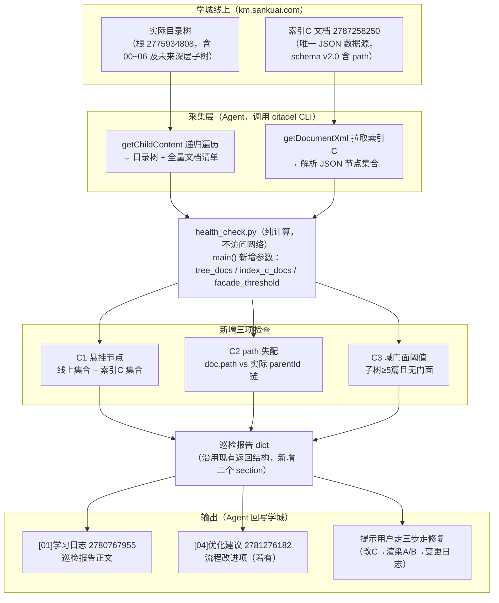

# 灵猫知识库健康巡检增强（R5）— 研发需求说明

> 版本：v1 ｜ 日期：2026-09-17 ｜ 来源：《灵猫三级索引-gardener需求.md》R5 项
> 交付对象：lingcat-knowledge-gardener skill 的 health_check.py 模块研发
> 关联文档：索引C（https://km.sankuai.com/collabpage/2787258250）、[01]学习日志（https://km.sankuai.com/collabpage/2780767955）、[04]优化建议（https://km.sankuai.com/collabpage/2781276182）

## 一、背景

### 1.1 知识库索引架构（现状）

灵猫通识知识库（学城，根 contentId 2775934808）的检索体系为"单一数据源 + 双视图"架构：

- **索引C**（学城文档 2787258250）：唯一权威索引数据源，正文为一个 JSON 代码块，含全库每个文档的 contentId、path（完整目录路径，schema v2.0 新增）、weight、status、summary、keywords、query_hint 等元数据；
- **索引A / 索引B**：由索引C 渲染生成的人读导航视图 / Agent 关键词反查视图，禁止手改；
- **变更日志**（2786789270）：记录库结构版本历史。

### 1.2 维护纪律与风险

结构变更依赖人工纪律执行"三步走"：①修改索引C → ②重新渲染A/B → ③变更日志追加一行。三步必须同批次完成。

问题在于：**这套纪律没有任何自动校验兜底**。只要有人绕过流程（在学城页面上直接新建子目录、移动/改名文档，而不改索引C），索引C 与实际目录树就会发生漂移且**无任何告警**——Agent 按索引C 检索时会漏掉新文档或指向已移动的文档。随着知识库目录树加深（schema v2.0 已支持任意深度 path）、参与维护的人增多，漂移概率单调上升。

### 1.3 目标

给现有巡检脚本 `health_check.py` 增加三项**结构一致性检查**，把"发现漂移"从依赖人工眼力变为周期性自动巡检，形成防漂移兜底网。

## 二、现有实现（研发需了解的约定）

`health_check.py` 位于 gardener skill 的 `scripts/` 目录，**不走** `lib/writer.py`，设计约定是"脚本纯计算、不访问网络"：所有线上数据由调用方（Agent）事先通过 citadel CLI 采集并结构化后传入 `main()`。现有签名：

```python
main(
    version_log_rows: list[dict],       # 00/变更日志索引表数据
    existing_content_ids: set,          # 索引C 中已登记的 contentId 集合
    pending_rows: list[dict],           # [05]待人工审核索引表数据
    coverage_rows: list[dict],          # 01~05 业务目录覆盖情况
    experience_scenes: list[str],       # [02]经验沉淀场景列表
) -> dict                              # 返回巡检报告，由 Agent 写入 [01]学习日志
```

巡检频率：建议每周一次（人工或自动化触发均可）。

## 三、需求详述：新增三项检查

| # | 检查项 | 一句话逻辑 | 严重级别 |
|---|--------|-----------|---------|
| C1 | 悬挂节点 | 线上目录树实际存在、但索引C 未登记的文档 | 高 |
| C2 | path 失配 | 索引C 中 doc.path 与该文档实际 parentId 链不一致（被移动/改名） | 高 |
| C3 | 域门面阈值 | 某子树文档 ≥5 篇且尚未建域门面导读页 | 低（建议级） |

### C1 悬挂节点（已存在未入索引）

**输入**：线上目录树全量遍历结果（含每篇文档 contentId、title、所在目录链）；索引C 节点集合。
**算法**：集合差——`线上文档集合 - 索引C登记集合`，再排除已知白名单（治理文档本身：索引A/B/C、变更日志、00 正文、根文档；以及 status=placeholder 的占位文档按现有规则可选排除）。
**输出**：悬挂节点清单（contentId、title、实际路径），并给出修复建议文案："走三步走补登记"。

### C2 path 失配（文档位置漂移）

**输入**：索引C 中每个 doc 的 path 字段；同一文档由线上遍历得到的实际路径。
**算法**：逐条比对 `index_c_doc.path` 与 `actual_path`（均规范化为 `一级目录/子目录/…` 格式，不含文档名）。不一致即失配。
**输出**：失配清单（contentId、索引C 记录路径、实际路径），建议文案："更新索引C path 并重渲染A/B"。

### C3 域门面阈值提醒

**输入**：线上目录树（含父子关系）；已建域门面的子树集合（索引C 中 path 指向域根且为门面导读页的叶子）。
**算法**：按实际目录树聚合每个子树的文档数，`count ≥ 5 且无门面` 时命中。阈值建议作为参数（默认 5，可配 3~8）。
**输出**：建议建域门面的子树清单（子树路径、文档数），建议文案："经人工确认后按 00 维护规则第七条建域内导读页"。此项仅是建议，不构成错误。

## 四、数据流与整体链路



巡检发现问题的修复闭环：C1/C2 命中 → 提示走三步走补登记/改 path → 变更日志留痕；C3 命中 → 人工确认后建域门面。**脚本只报告、不自动修复**。

## 五、接口变更建议

`main()` 在现有五个参数基础上新增三个（保持向后兼容，缺省时跳过对应检查）：

```python
main(
    ...,                                   # 现有参数不变
    tree_docs: list[dict] = None,          # [{"contentId":..., "title":..., "path": "01-xxx/子目录"}] 线上实际结构
    index_c_docs: list[dict] = None,       # [{"contentId":..., "path":...}] 索引C 登记数据
    facade_threshold: int = 5,             # C3 阈值
) -> dict
```

返回报告建议新增 `structure_check` section，含 `hanging_nodes` / `path_mismatch` / `facade_candidates` 三个列表及各自的建议文案。

## 六、验收标准

1. 用当前线上真实数据（25 节点、18 篇入索引文档、schema v2.0）跑一次：C1 应为空（或仅白名单差异）、C2 应为空、C3 应为空——即"健康库零误报"。
2. 人为构造样例：本地 mock 一篇未入索引的文档、一处 path 不一致、一个 6 篇文档的子树，三项检查均应命中且报告文案准确。
3. 向后兼容：不传新参数时行为与现有版本完全一致（回归现有五项检查）。
4. 报告写入 [01]学习日志 的链路沿用现有机制，无需改动。

## 七、非目标与边界

- 不做自动修复：发现漂移只报告，修复动作走三步走并需用户确认；
- 不做学城 API 直连：数据采集仍由 Agent + citadel 完成，脚本保持纯计算、可单测；
- 不做定时调度：触发方式（人工/自动化）由使用方决定，本期只保证可被无状态调用；
- 白名单维护：治理类文档（索引A/B/C、变更日志、00 正文、根文档）不参与 C1 告警，白名单可作为常量或参数。
